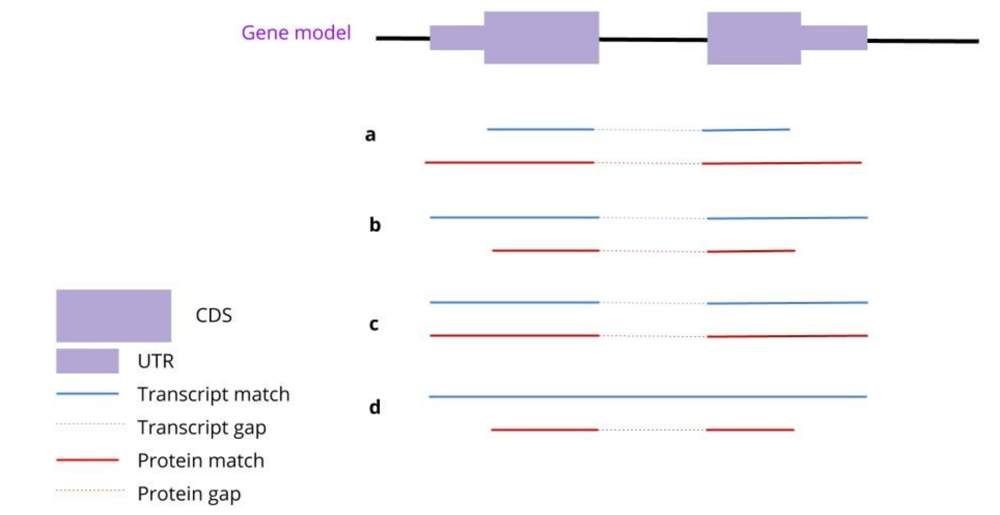

# Test Yourself

1. What are the uses of transcript and protein sequences in the context of structural gene annotation?
* Evidence for the presence and structure of genes
* Training data for ab-initio gene prediction
* Determine the function of genes, based on sequence similarity
* Detect and mask repetitive regions of the genome

2. Which evidence set is the most likely to have produced the gene model depicted in the figure?

3. What genome coordinates correctly describe a region of length 1001 starting at position 1000 (including) and ending at position 2000 (including), in a BED file and in a GFF file?
* BED: 999-2000 ; GFF: 1000-2000
* BED: 999-1999 ; GFF: 1000-2001
* BED: 1000-2000 ; GFF: 1000-2000
* BED: 999-2000 ; GFF: 1001-2000
* BED: 1000-1999 ; GFF: 1000-1999

4. You use two different annotation pipelines (tool A and tool B) to annotate a genome assembly, and get two gff3 files: tool_A.gff3 and tool_B.gff3. Now you want to find genes annotated only by tool A. Which of the following commands should you use?
* Bedtools intersect -a tool_A.gff3 -b tool_B.gff3 -v
* Bedtools intersect -a tool_B.gff3 -b tool_A.gff3 -v
* Bedtools intersect -a tool_A.gff3 -b tool_B.gff3
* Bedtools intersect -a tool_B.gff3 -b tool_A.gff3

5. Which of the following statements regarding functional annotation is correct?
* Sequence similarity can help determine the function of a gene
* Matches to protein domains databases (e.g. Interpro) can be used as hints for the function of a gene
* Ab-initio predictions can detect the function of a gene using only its genomic sequence
* Functional annotation allows accurate detection of intron-exon junctions
* Blastp cannot be used for functional annotation since protein sequences are not involved

