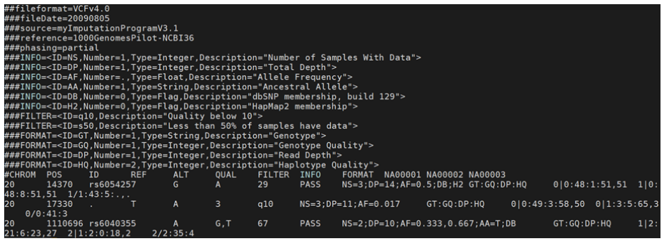
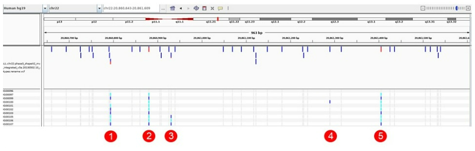

# Test Yourself

1. Which of the following is correct regarding the minor allele?
* Rare variants have low minor allele frequency
* The minor allele always has frequency < 50%
* Rare variants have high minor allele frequency
* The reference allele always has allele frequency > 50%

2. Which of the following is not an advantage of variant calling using NGS data over using SNP arrays?
* More accurate
* Can detect previously unknown variants
* When genotyping, the set of tested variants can be changed more easily
* Can be used to genotype any number of variants

3. When trying to detect large deletions in a tested genome, which of the following can be an evidence?
* Decrease in sequencing depth at a certain region
* Paired reads showing mapping with distance larger than the expected insert size
* Split reads mapping to the reference genome
* Paired reads showing mapping with distance smaller than the expected insert size
* Increased sequencing depth at a certain region

4. Look at the VCF. How many reads provided evidence for the genotype of sample *NA00002* in position 17,330?

* 5
* 11
* 3
* 10

5. Look at the IGV snapshot, showing a VCF file. Which of the variants has the smallest minor allele frequency?

* 1
* 2
* 3
* 4
* 5

